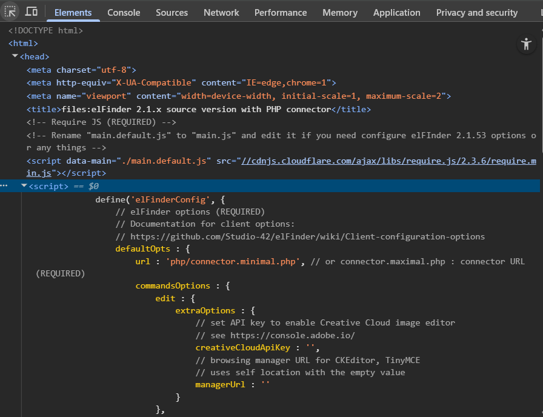
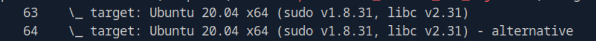
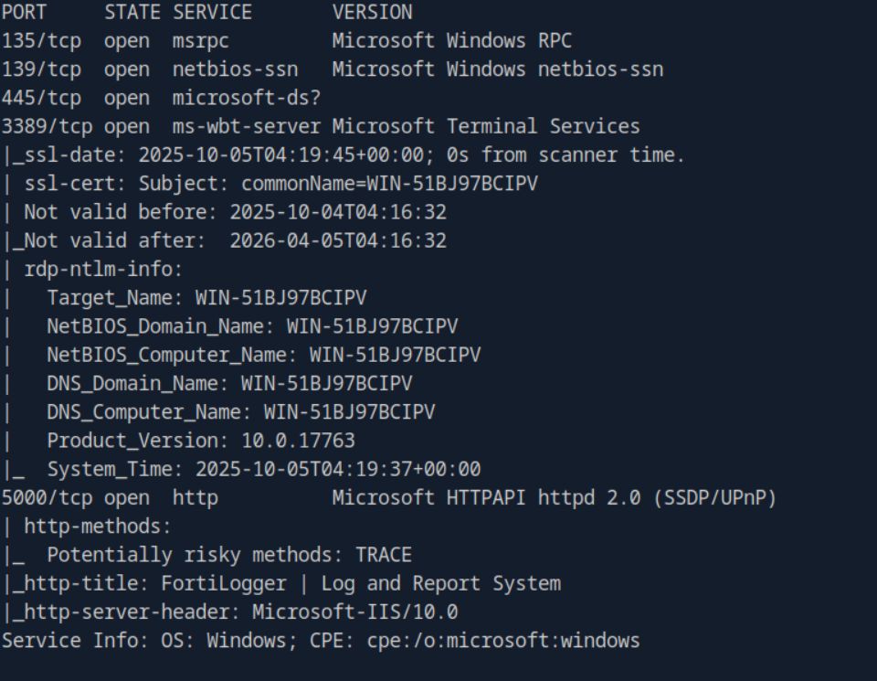
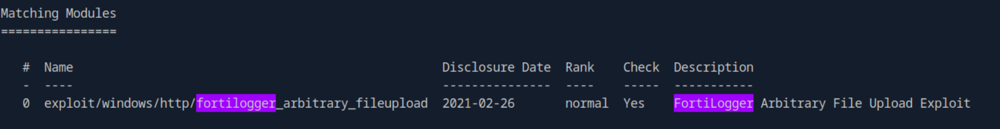

# HTB-Using_the_Metasploit_Framework

## Table of Contents
1. [Introduction](#introduction)
    1. [Introduction to Metasploit](#introduction-to-metasploit)
2. [MSF components](#msf-components)
    1. [Modules](#modules)
    2. [Payloads](#payloads)
3. [MSF Sessions](#msf-sessions)
    1. [Sessions](#sessions)
    2. [Meterpreter](#meterpreter)

## Introduction
### Introduction to Metasploit
#### Challenges 
1. Which version of Metasploit comes equipped with a GUI interface?

    The answer is `Metasploit Pro`.

2. What command do you use to interact with the free version of Metasploit?

    The answer is `msfconsole`.

## MSF Components
### Modules
#### Challenges
1. Use the Metasploit-Framework to exploit the target with EternalRomance. Find the flag.txt file on Administrator's desktop and submit the contents as the answer.

    To solve this, we can use metasploit with `windows/smb/ms17_010_psexec` modules. Then we need to set the RHOSTS and LHOST. The answer is `HTB{MSF-W1nD0w5-3xPL01t4t10n}`.

### Payloads
#### Challenges
1. Exploit the Apache Druid service and find the flag.txt file. Submit the contents of this file as the answer.

    To solve this, first we need to find `apache` modules. But it have `322` type. So in here, i used grep to minimize it.

    ```bash
    grep druid search apache
    ```

    It gave two results. I tried number 42 `exploit/linux/http/apache_druid_js_rce`.

    

    Then i set the RHOSTS and LHOST. I used default payload in here. Then we can get meterpreter session. Just use `search -f flag.txt` to locate the flag. The answer is `HTB{MSF_Expl01t4t10n}`.

### Plugins
#### Tools
1. pentest.rb (very powerful for pentest)

## MSF Sessions
### Sessions
#### Challenges
1. We con solve this by looking in the source code. 

    

    Based on that, the answer is elfinder.

2. Find the existing exploit in MSF and use it to get a shell on the target. What is the username of the user you obtained a shell with?

    To solve this we can search `elfinder` module in metasploit. In here, i used `exploit/linux/http/elfinder_archive_cmd_injection` module. Then after get the shell, type `whoami`. The answer is `www-data`.

3. The target system has an old version of Sudo running. Find the relevant exploit and get root access to the target system. Find the flag.txt file and submit the contents of it as the answer.

    In the shell, we search the sudo version by typing `sudo --version`.  We can get the version of sudo is `Sudo version 1.8.31`. Then we background our current session with `ctrl + z`. In the msfconsole, we type this.

    ```bash
    grep 1.8.31 search sudo
    ```

    

    In here i used module 63. After run it, we can get the root previllege. The answer is `HTB{5e55ion5_4r3_sw33t}`.

### Meterpreter
#### Tools
1. search local_exploit_suggester (Use this module if we already have session)
#### Challenges
1. Find the existing exploit in MSF and use it to get a shell on the target. What is the username of the user you obtained a shell with?

    To solve this, first we enumerate using nmap.

    ```bash
    sudo nmap -sV -sC 10.129.203.65
    ```

    Here the output. 

    

    Based on that, i choose to explore port 5000. I search in metasploit `FortiLogger`. I found this. 

    

    After set RHOSTS and LHOST and run it, we can get the meterpreter session. The answer is `nt authority\system`.

2. Retrieve the NTLM password hash for the "htb-student" user. Submit the hash as the answer.

    To solve this, we can use `kiwi` plugins. Then type `lsa_dump_sam` in the meterpreter session. The answer is `cf3a5525ee9414229e66279623ed5c58`.


