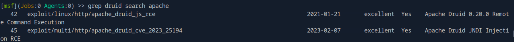

# HTB-Using_the_Metasploit_Framework

## Table of Contents
1. [Introduction](#introduction)
    1. [Introduction to Metasploit](#introduction-to-metasploit)
2. [MSF components](#msf-components)
    1. [Modules](#modules)
    2. [Payloads](#payloads)

## Introduction
### Introduction to Metasploit
#### Challenges 
1. Which version of Metasploit comes equipped with a GUI interface?

    The answer is `Metasploit Pro`.

2. What command do you use to interact with the free version of Metasploit?

    The answer is `msfconsole`.

## MSF Components
### Modules
#### Challenges
1. Use the Metasploit-Framework to exploit the target with EternalRomance. Find the flag.txt file on Administrator's desktop and submit the contents as the answer.

    To solve this, we can use metasploit with `windows/smb/ms17_010_psexec` modules. Then we need to set the RHOSTS and LHOST. The answer is `HTB{MSF-W1nD0w5-3xPL01t4t10n}`.

### Payloads
#### Challenges
1. Exploit the Apache Druid service and find the flag.txt file. Submit the contents of this file as the answer.

    To solve this, first we need to find `apache` modules. But it have `322` type. So in here, i used grep to minimize it.

    ```bash
    grep druid search apache
    ```

    It gave two results. I tried number 42 `exploit/linux/http/apache_druid_js_rce`.

    

    Then i set the RHOSTS and LHOST. I used default payload in here. Then we can get meterpreter session. Just use `search -f flag.txt` to locate the flag. The answer is `HTB{MSF_Expl01t4t10n}`.